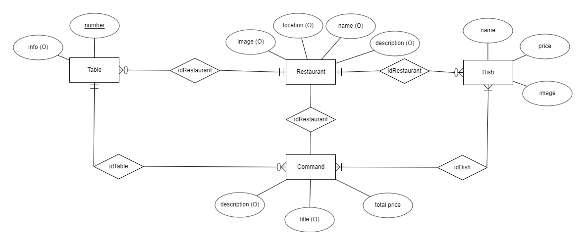

# RestaurAPP Android

Versión para dispositivos móviles Android de la aplicación RestaurAPP

   

Para acceder al repositorio de RestaurAPP conjunto haga click [aqui](https://github.com/DavidAntunezPerez/RestaurAPP)

Para acceder al repositorio principal de IESCampanillas de proyectos haga click [aqui](https://github.com/IESCampanillas/proyectos-dam-2023)

## Índice: 
1. [Descripción y funcionalidades](#descripción-y-funcionalidades)
2. [Diagrama de la base de datos](#diagrama-de-la-base-de-datos)
3. [Gestión del proyecto](#gestión-del-proyecto)
4. [Histórico de cambios](#histórico-de-cambios)
5. [Descarga de la APP](#descarga-de-la-app)
6. [Manual de instalación y dependencias](#manual-de-instalación-y-dependencias)
7. [Manual de uso de la aplicación](#manual-de-uso-de-la-aplicación)
8. [Bibliografía](#bibliografía)

### Descripción y funcionalidades

Aplicación nativa del proyecto RestaurAPP. 
Esta aplicación funciona de forma conjunta con la [aplicación híbrida de RestaurAPP](https://github.com/AleCueto/restauraap) para el [Proyecto fin de ciclo 2º DAM 22/23](https://github.com/IESCampanillas/proyectos-dam-2023). 

La aplicación está desarrollada en su totalidad por [David Antúnez Pérez](https://github.com/DavidAntunezPerez) utilizando principalmente el entorno de desarrollo de [Android Studio](https://developer.android.com/studio) en conjunto al lenguaje [Kotlin](https://kotlinlang.org/) con el uso de [Python](https://www.python.org/) para alguna funcionalidad.

Esta aplicación está desarrollada para llevar el sistema de mesas y comandas por cada camarero en cualquier restaurante. Te permitirá tanto crear, ver, editar o eliminar una serie de comandas (o pedidos) en función a la necesidad del camarero en el momento.

La aplicación permite agregar además una descripción y un título a cada comanda en su creación (o añadirlo posteriormente en la edición de esta). También, permite filtrar resultados para encontrar fácilmente tanto un plato como una comanda mediante una barra de búsqueda situada encima de las listas en la página.

Además, también permite la función de gestionar los ajustes de la aplicación, así como crear un perfil donde agregar Nombre, Descripción, Ubicación o Imagen para tu restaurante. En cuanto a la imagen, se podrá tanto tomar una imagen de la propia cámara en ese momento o subir una de la galería del dispositivo, así como eliminar la imagen de perfil para dejar la que esta predeterminada en la aplicación.

También cuenta con la opción de cambio de idioma entre Inglés y Español, que está presente en el apartado de Ajustes o en las pestañas de Inicio de Sesión y Registro.

Además de las propias opciones de Inicio de Sesión y Registro, que podrán realizarse tanto con correo electrónico y contraseña como con una cuenta de Google.

Otra funcionalidad a mencionar es la de Exportar a CSV, que, mediante el uso de la librería [Chaquopy](https://chaquo.com/chaquopy/) permite ejecutar un script de Python que descargará un archivo .CSV en nuestro dispositivo móvil con la cuenta de una comanda, incluyendo título, descripción, listado de platos pedidos con su precio, precio total a pagar... Los camareros pueden usar esta funcionalidad para mostrar al cliente la cuenta final del pedido y así ahorrar papel y material de impresión. Además de tener guardado la información de cada comanda en el dispositivo móvil de forma sencilla.

### Diagrama de la base de datos

Este es el esquema de la base de datos planteado con [ERDPLus](https://erdplus.com/). Además, de esta imagen, podeis encontrar un archivo para importar el esquema [aqui](https://github.com/DavidAntunezPerez/RestaurAPP_Android/blob/master/erd_diagram/restaurapp_android.erdplus).

   

### Gestión del proyecto

Para la gestión de este proyecto se ha utilizado la herramienta [Jira Software](https://www.atlassian.com/es/software/jira).

En ella se han dividido las tareas del proyecto en cinco columnas:
 - Main Tasks: Tareas principales a realizar, tareas de realización fundamental.
 - Secondary Tasks: Tareas un poco más simples, que no requieren de tanto tiempo, y de interés secundario.
 - In Progress: Tareas que actualmente se encuentran en proceso de desarrollo.
 - Bugs: Errores conocidos y aun por solucionar.
 - Deprecated/Future Tasks: Tareas que están pensadas para ser agregadas en un futuro o que han sido descartadas por el momento.
 
 En total se han tratado de treinta y dos tareas divididas en estas cuatro columnas.
 
### Histórico de cambios

Para acceder al histórico de cambios de la aplicación haga
click [aqui](https://github.com/DavidAntunezPerez/RestaurAPP_Android/commits)

### Descarga de la APP

Para descargar la APP, puedes hacer click en el apartado RELEASES de GitHub o hacer click [aqui](https://github.com/DavidAntunezPerez/RestaurAPP_Android/releases)

Procura descargar la última versión de la aplicación. Al descargar el release, tendrás acceso a un archivo .apk que podrás utilizar en tu dispositivo Android para instalar la aplicación.

### Manual de instalación y dependencias

Los requisitos para que tengamos instalados la aplicación son los siguientes:

- Disponer de espacio suficiente para poder descargar e instalar la aplicación.
- Un dispositivo Android con una versión de API mínima de 30 y una máxima de 32 (Es decir, desde Android 11: Red Velvet Cake hasta Android 12: Snow Cone) . Se recomienda el uso de la API 30.
- Tener los Servicios de Google actualizados y con un funcionamiento correcto.
- Para la consulta de archivos .CSV, utilizar una aplicación de lectura de estos archivos, como recomendación, podeis usar [Excel de Microsoft](https://play.google.com/store/apps/details?id=com.microsoft.office.excel).

Una vez cumplamos con todos los requisitos, podemos pasar a instalar la aplicación:
- Descargar el [archivo APK de la aplicación](https://github.com/DavidAntunezPerez/RestaurAPP_Android/releases). 
- Haga click en el archivo APK en su dispositivo Android y haga click en Instalar.
- Se instalará RestaurAPP en su dispositivo y ya estará lista para su uso.

### Manual de uso de la aplicación

Para acceder al manual en Español, puedes visitar la Wiki de este repositorio [aqui](https://github.com/DavidAntunezPerez/RestaurAPP_Android/wiki/%5BES%5D-Manual-de-uso-de-RestaurAPP-Android)

### Bibliografía

Para el desarrollo de esta aplicación, se han utilizado diferentes herramientas y estudiado distintas fuentes:

- [Canva](https://www.canva.com/): Como herramienta de diseño de imágenes y el propio logo.
- [Iconos8](https://iconos8.es/): Como herramienta para la descarga y utilización de los iconos del proyecto en diferentes formatos.
- [Figma](https://www.figma.com/): Utilizado para desarrollar el [Anteproyecto](https://github.com/DavidAntunezPerez/restaurapp#anteproyecto).
- [Jira Software](): Utilizado para gestionar el proyecto durante su desarrollo, más información en el [apartado de gestión del proyecto](https://github.com/DavidAntunezPerez/RestaurAPP_Android#gesti%C3%B3n-del-proyecto).
- [Google Firebase](https://firebase.google.com/): Utilizado como servicio externo para consumir datos y como base de datos con Firestore, para almacenar imágenes con Storage, y como herramienta de autenticación de usuarios con Authentication.
- [PowerBI](https://powerbi.microsoft.com/es-es/): Para cumplir con los [requisitos del módulo desarrollo de interfaces](https://github.com/IESCampanillas/proyectos-dam-2023/wiki/Desarrollo-de-Interfaces) y con los [requisitos del módulo de sistemas de gestión empresarial](https://github.com/IESCampanillas/proyectos-dam-2023/wiki/Sistemas-de-Gesti%C3%B3n-Empresarial).
- [Material Design](https://m2.material.io/): Como guía completa para el diseño visual, y como herramienta para el diseño de los layouts.
- [Kotlin](https://kotlinlang.org/): Como lenguaje principal de programación para realizar la aplicación.
- [Python](https://www.python.org/) y [Chaquopy](https://chaquo.com/chaquopy/): Utilizados para la creación y ejecución del script encargado de la generación de archivos CSV. Se han utilizado las librerías de [Numpy](https://numpy.org/) y [Pandas](https://pandas.pydata.org/) para el desarrollo del script.
- [Android Studio](https://developer.android.com/studio):Como entorno de desarrollo integrado para el desarrollo de la aplicación.
- [DaFont](https://www.dafont.com/): Para la descarga de fuentes de texto usadas en la aplicación.
- [Dokka](https://github.com/Kotlin/dokka): Para la generar la [documentación del proyecto](https://github.com/DavidAntunezPerez/RestaurAPP_Android/tree/master/documentation/dokka/htmlMultiModule).
- [GitHub](https://github.com/): Para gestionar el proyecto, controlar versiones de código y almacenar el código del proyecto en la nube.
- [Git](https://git-scm.com/): Usado como  sistema de control de versiones en el proyecto.
- [Glide](https://github.com/bumptech/glide): Para la gestión de los archivos multimedia de la aplicación.
- [ERDPlus](https://erdplus.com/): Para la creación del diagrama ERD de la base de datos.
